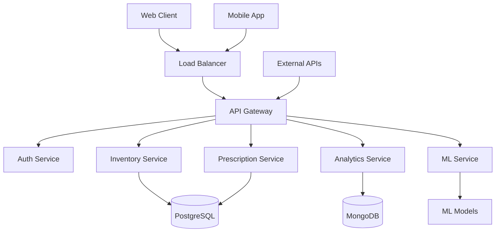

# AI-Powered Pharmacy Management System
## Technical Specification Document
Version 1.0 | Date: 2024

## Table of Contents
1. [System Overview](#system-overview)
2. [System Architecture](#system-architecture)
3. [Database Design](#database-design)
4. [API Specification](#api-specification)
5. [AI/ML Components](#ai-ml-components)
6. [Security & Compliance](#security-compliance)
7. [Integration Architecture](#integration-architecture)
8. [Testing Strategy](#testing-strategy)
9. [Deployment Architecture](#deployment-architecture)
10. [Project Timeline](#project-timeline)
11. [Risk Assessment](#risk-assessment)
12. [Success Criteria](#success-criteria)
13. [Maintenance Procedures](#maintenance-procedures)

## 1. System Overview

### 1.1 Purpose
The AI-Powered Pharmacy Management System (APMS) is designed to modernize pharmacy operations through intelligent automation, predictive analytics, and seamless integration with existing healthcare systems.

### 1.2 Core Features
- Inventory Management with AI-driven stock predictions
- Prescription Processing & Verification
- Drug Interaction Analysis
- Patient Management
- Insurance Processing
- Regulatory Compliance Management
- Analytics Dashboard
- Mobile Application for Staff and Patients

## 2. System Architecture

### 2.1 Technology Stack
```
Frontend:
- Next.js 14 (App Router)
- TypeScript
- TailwindCSS
- shadcn/ui Components
- PWA Support

Backend:
- Node.js with Express
- TypeScript
- Redis for Caching
- PostgreSQL (Primary Database)
- MongoDB (Analytics Data)

AI/ML:
- Python 3.11
- TensorFlow 2.x
- scikit-learn
- FastAPI for ML Service

DevOps:
- Docker & Kubernetes
- GitHub Actions
- AWS Cloud Infrastructure
- Prometheus & Grafana Monitoring
```

### 2.2 Architecture Diagram


## 3. Database Design

### 3.1 PostgreSQL Schema
```sql
-- Users and Authentication
CREATE TABLE users (
    id UUID PRIMARY KEY DEFAULT gen_random_uuid(),
    email VARCHAR(255) UNIQUE NOT NULL,
    role VARCHAR(50) NOT NULL,
    created_at TIMESTAMP WITH TIME ZONE DEFAULT CURRENT_TIMESTAMP
);

-- Inventory
CREATE TABLE medications (
    id UUID PRIMARY KEY DEFAULT gen_random_uuid(),
    ndc_code VARCHAR(50) UNIQUE NOT NULL,
    name VARCHAR(255) NOT NULL,
    manufacturer VARCHAR(255),
    stock_quantity INTEGER NOT NULL,
    reorder_point INTEGER NOT NULL,
    unit_price DECIMAL(10,2) NOT NULL,
    created_at TIMESTAMP WITH TIME ZONE DEFAULT CURRENT_TIMESTAMP
);

-- Prescriptions
CREATE TABLE prescriptions (
    id UUID PRIMARY KEY DEFAULT gen_random_uuid(),
    patient_id UUID REFERENCES users(id),
    medication_id UUID REFERENCES medications(id),
    dosage VARCHAR(100) NOT NULL,
    frequency VARCHAR(100) NOT NULL,
    prescribed_by UUID REFERENCES users(id),
    status VARCHAR(50) NOT NULL,
    created_at TIMESTAMP WITH TIME ZONE DEFAULT CURRENT_TIMESTAMP
);
```

### 3.2 MongoDB Collections
```javascript
// Analytics Schema
{
  inventory_analytics: {
    medication_id: UUID,
    timestamp: Date,
    stock_level: Number,
    demand_forecast: Number,
    confidence_score: Number
  },
  
  prescription_analytics: {
    prescription_id: UUID,
    processing_time: Number,
    verification_score: Number,
    interaction_flags: Array
  }
}
```

## 4. API Specification

### 4.1 RESTful Endpoints
```typescript
// Authentication
POST   /api/v1/auth/login
POST   /api/v1/auth/logout
POST   /api/v1/auth/refresh

// Inventory Management
GET    /api/v1/inventory
POST   /api/v1/inventory
GET    /api/v1/inventory/:id
PUT    /api/v1/inventory/:id
DELETE /api/v1/inventory/:id

// Prescriptions
GET    /api/v1/prescriptions
POST   /api/v1/prescriptions
GET    /api/v1/prescriptions/:id
PUT    /api/v1/prescriptions/:id
DELETE /api/v1/prescriptions/:id

// Analytics
GET    /api/v1/analytics/inventory
GET    /api/v1/analytics/prescriptions
GET    /api/v1/analytics/forecasts
```

### 4.2 WebSocket Events
```typescript
// Real-time Updates
'inventory.updated'
'prescription.status.changed'
'alert.stock.low'
'alert.interaction.detected'
```

## 5. AI/ML Components

### 5.1 Models

#### 5.1.1 Inventory Prediction Model
```python
# Model Architecture
model = Sequential([
    Dense(128, activation='relu', input_shape=(input_dim,)),
    Dropout(0.3),
    Dense(64, activation='relu'),
    Dense(32, activation='relu'),
    Dense(1, activation='linear')
])
```

Training Data Requirements:
- Historical inventory levels (min. 2 years)
- Sales data
- Seasonal patterns
- External events data
- Weather data (if relevant)

Performance Metrics:
- RMSE < 10% of average stock level
- MAE < 5% of average stock level
- 95% confidence interval accuracy

### 5.1.2 Drug Interaction Model
- Architecture: BERT-based transformer
- Training Data: FDA drug interaction database
- Minimum Accuracy: 99.9%
- False Positive Rate: < 0.1%

## 6. Security & Compliance

### 6.1 Security Measures
- OAuth 2.0 + JWT Authentication
- Role-Based Access Control (RBAC)
- End-to-end Encryption (AES-256)
- Rate Limiting
- SQL Injection Prevention
- XSS Protection
- CSRF Protection

### 6.2 Compliance Requirements
- HIPAA Compliance
- GDPR Compliance
- FDA 21 CFR Part 11
- PCI DSS (for payment processing)
- State Board of Pharmacy Regulations

## 7. Integration Architecture

### 7.1 External Systems
- Electronic Health Records (HL7 FHIR)
- Insurance Providers (NCPDP)
- Wholesale Suppliers
- Payment Processors
- State PDMP Systems

### 7.2 Integration Methods
```typescript
interface IntegrationConfig {
  type: 'REST' | 'SOAP' | 'HL7' | 'DIRECT';
  endpoint: string;
  authentication: {
    type: 'OAuth2' | 'ApiKey' | 'Certificate';
    credentials: Credentials;
  };
  retry: {
    attempts: number;
    backoff: 'exponential' | 'linear';
  };
}
```

## 8. Testing Strategy

### 8.1 Testing Levels
1. Unit Testing (Jest, PyTest)
2. Integration Testing (Supertest)
3. E2E Testing (Cypress)
4. Performance Testing (k6)
5. Security Testing (OWASP ZAP)

### 8.2 Test Coverage Requirements
- Backend: > 90%
- Frontend: > 85%
- ML Models: > 95%

## 9. Deployment Architecture

### 9.1 AWS Infrastructure
```yaml
Infrastructure:
  VPC:
    Subnets: 
      - Public
      - Private
      - Database
  EKS:
    NodeGroups:
      - Application
      - ML
  RDS:
    - PostgreSQL
  DocumentDB:
    - MongoDB
  ElastiCache:
    - Redis
  S3:
    - Assets
    - Backups
```

### 9.2 Scaling Strategy
- Horizontal Pod Autoscaling
- RDS Read Replicas
- Redis Cluster
- CDN for Static Assets

## 10. Project Timeline

### Phase 1 (Months 1-3)
- Core Infrastructure Setup
- Basic CRUD Operations
- Authentication System

### Phase 2 (Months 4-6)
- Inventory Management
- Prescription Processing
- Basic Analytics

### Phase 3 (Months 7-9)
- AI/ML Model Integration
- Advanced Analytics
- Mobile Application

### Phase 4 (Months 10-12)
- External Integrations
- Performance Optimization
- Security Hardening

## 11. Risk Assessment

| Risk | Impact | Probability | Mitigation |
|------|---------|------------|------------|
| Data Breach | High | Low | Regular security audits, encryption |
| System Downtime | High | Low | Redundancy, failover systems |
| ML Model Accuracy | Medium | Medium | Continuous training, monitoring |
| Integration Failures | Medium | Medium | Robust error handling, fallbacks |
| Regulatory Changes | High | Medium | Regular compliance reviews |

## 12. Success Criteria

### 12.1 Technical Metrics
- System Uptime: 99.99%
- API Response Time: < 200ms
- ML Model Accuracy: > 95%
- Zero Critical Security Vulnerabilities

### 12.2 Business Metrics
- 50% Reduction in Manual Processing
- 30% Improvement in Inventory Accuracy
- 40% Reduction in Processing Errors

## 13. Maintenance Procedures

### 13.1 Routine Maintenance
- Daily: Backup Verification
- Weekly: Performance Analysis
- Monthly: Security Scans
- Quarterly: Compliance Audits

### 13.2 Update Procedures
```yaml
Update Process:
  1. Development Environment:
    - Code Review
    - Automated Testing
    - Security Scan
  2. Staging Environment:
    - Integration Testing
    - Performance Testing
    - User Acceptance Testing
  3. Production Environment:
    - Backup
    - Rolling Update
    - Monitoring
    - Rollback Plan
```

---

Document Status: Draft
Last Updated: 2024
Review Date: Quarterly